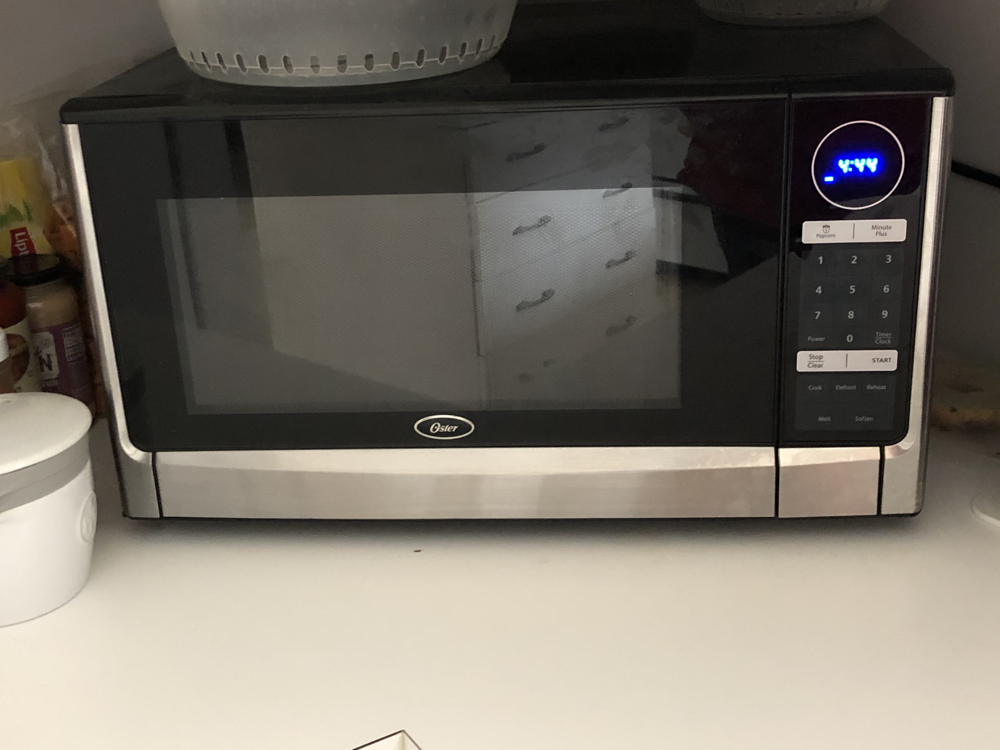
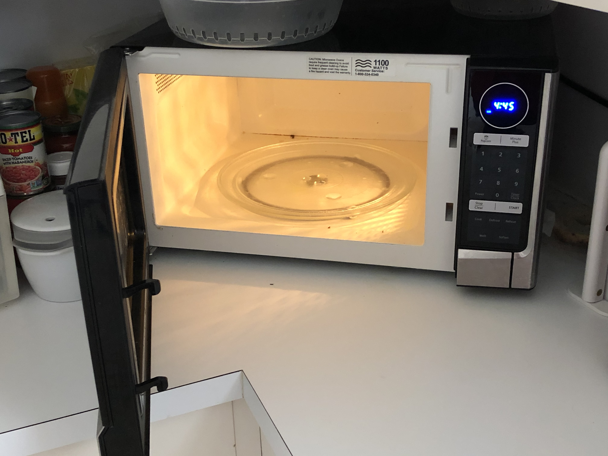
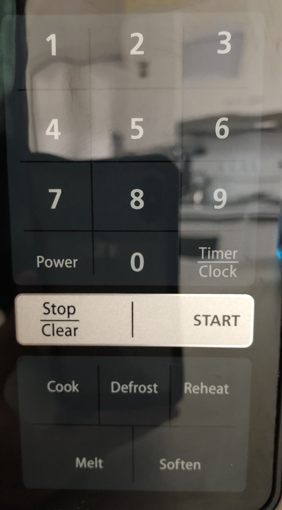
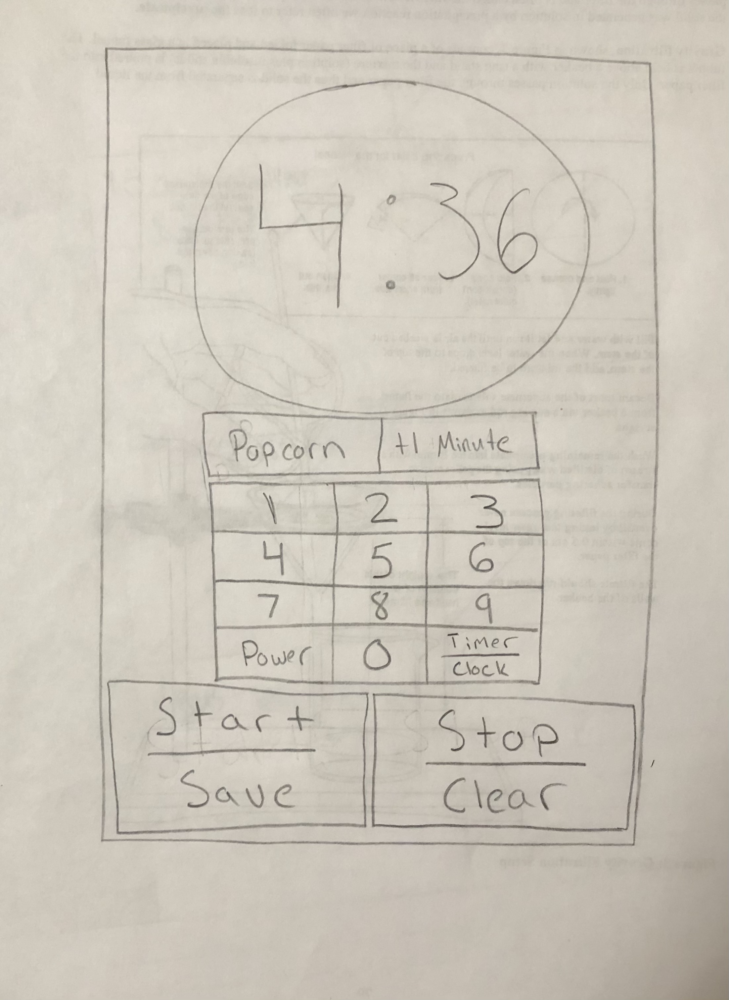
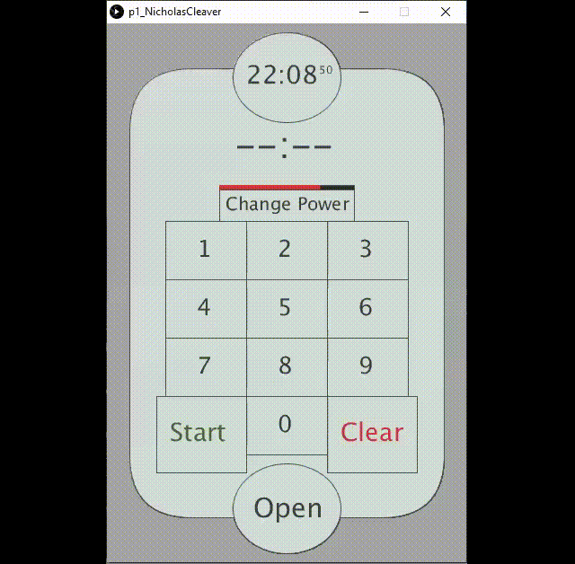
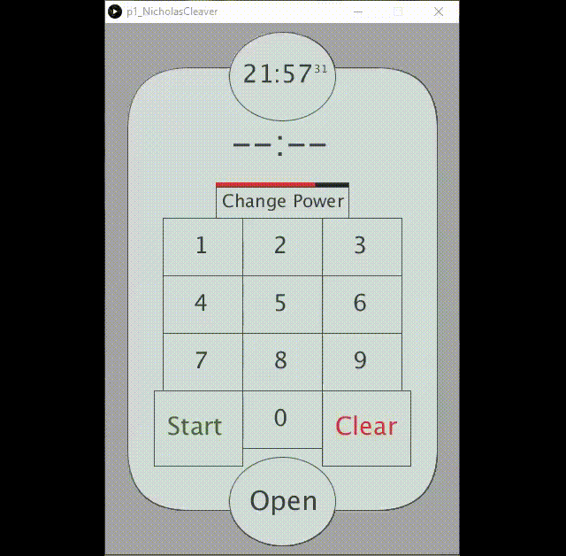

# Microwave Project | Human Computer Interaction
#### Nicholas Cleaver | Spring 2021 | Texas Tech University
<a href="https://nlc823.github.io/p1.NicholasCleaver/">Pages Link</a> | 
<a href="https://github.com/NLC823/p1.NicholasCleaver/blob/main/README.md#part-1">For C</a> | 
<a href="https://github.com/NLC823/p1.NicholasCleaver/blob/main/README.md#part-2">For B</a> | 
<a href="https://github.com/NLC823/p1.NicholasCleaver/blob/main/README.md#part-3">For A</a>
## Part 1
This is the microwave we have in my house:

And here you can see it in use:

And this is the interface up close:

This microwave is very convenient for standard everyday uses. It is intuitive to press the numbers and then press start and have the microwave work for the designated time, however, there are some apparent design flaws.

First, the button to the right of **0**, what does it mean to have a **Timer / Clock** button? The **Stop / Clear** button uses the same notation, but those two tasks are relatable in a way that timer and clock are not. This button is not easily understood without experimentation, in fact, I had to return to the kitchen to really remember what it did while writing this page. Pressing this button once will allow you to set the time to whatever time by pressing the numbers, you can confirm the change by pressing start, but if you press the **Timer / Clock** button again, the microwave brings up EE. I have no idea what EE means and pressing any other button when the microwave is in this state has no effect. To exit this state you must press the **Stop / Clear** button. See below for this interaction:

Second, there are several buttons on the microwave in which it is not clear what they do to the microwave. These buttons appear at the bottom of the interface and include **Cook**, **Defrost**, **Reheat**, **Melt** and **Soften**. Are these buttons quick ways to start timers of specific lengths? Do these buttons change the power level of the microwave? Do these buttons automatically start or do you need to press start after pressing one of these buttons? I have had this microwave for years and I do not think I can answer a single one of these questions for any of these buttons. The choice of words used, however, has meaning in English so maybe if we want to soften some butter, we can just throw it in the microwave and press **Soften**. It might work, but it is still unclear what the microwave does to achieve this. However, this will not work. These buttons bring you through a complicated menu sequence where you must use memorized codes and enter the buttons in a correct order to get the microwave to start. I never use these modes and I can't even get the microwave to start when I press one of these buttons.

Third, there is no way to lock the microwave in a lower power setting. I change the power level by pressing the **Power** button. The first press displays the normal power level (**HI**) and repeatedly pressing this button lowers the power level to **90**, then **80**, then **70** and so on all the way down to **00**. After the desired power level is reached you enter the amount of time you want the microwave to go for and press **Start**. After the microwave is done that job, the power is back to max for the next job. if an item needs more time on a lower power level you must go through the power settings again to get there. This would be much less of a problem if you didn't need to press the power button so many times to reach the lower power levels (example: 8 presses to reach 30% power). It should also be noted that you can't press the buttons too quickly or it will not register the next press, I assume this is a mechanism in place for times when you accidentally double press a button.

## Part 2

The most common thing I do with a microwave, by far, is set a timer for a desired time and press **Start**. I wait until my dish is done and I take it out. This is extremely easy to do with this microwave and I have no complaints with how it is handled. The next most common use for my microwave is to change the power level of the microwave.  This is much less intuitive than just starting a timer, but overall not too bad. Just remember that the microwave resets to **HI** after every use so it is best to put the timer on for longer than you need and take the dish out part way to check it then resume if needed.

My least common uses of this microwave include adding extra time while the microwave is going and using any of the interesting buttons at the bottom. The **Minute Plus** button adds a minute to the current microwave time with a single press and is very easy to use, however, the buttons at the bottom are a different story. As explained above, these buttons being you to a complicated menu sequence where you need to have memorized codes for what you want to accomplish, and I don't even know how to start the microwave in this mode.

The most common sequence of actions I take when using the microwave is:
1. Open the door
2. Place dish inside
3. Close the door
4. Enter time to cook
5. Press **Start**
6. Wait for dish to be ready
7. Open the door
8. Remove dish, now warm
9. Close the door
I assume it is the same for most microwave users.

Learning how the microwave is accomplished through a combination of using other microwaves and the intuitiveness of the buttons. Most buttons are self-explanatory and this microwave operates very similarly to most other microwaves so you will not be confused if you have used another microwave before. The one notable exception to this is the buttons at the bottom. To learn how these work I suspect that you would need to read the manual for the microwave.

The microwave provides feedback to the user every time a button is pressed. You get a single beep if the action was received and worked and you get a double beep if the action didn't do anything, this happens regularly with the buttons at the bottom.

One common mistake you could make when starting out with the microwave involves setting the time. The **EE** error explained in part 1 occurs when you follow a logical process to set the time. You press the **Timer / Clock** button and enter the time. You may thing that pressing the **Timer / Clock** button again would set the time and bring you back to the main screen. Instead, you get the **EE** error.

If I was to fix the problems with the microwave interface, the first thing I would do is remove the buttons along the bottom. As I have made very clear, these buttons are useless unless you want to memorize a bunch of codes and spend significant time learning exactly what they do. The removal of these buttons will take away next to nothing from the user while also freeing up space to enlarge some more important parts of the interface. The parts of the interface I would enlarge with the extra space is the clock at the top and the **Start** and **Stop / Clear** buttons. Enlarging the clock will make it easier to see how much time is remaining from far away and the **Start** and **Stop / Clear** buttons are most important so making them larger gives emphasis to this as well as making them easier to press. Next I would change the name of the **Minute Plus** button to be **+1 Minute**. I think this is a much more intuitive name for what the button does. I would also change the name of the **Start** button to be **Start / Save** as the start button is used as a confirmation button in many of the microwaves menu screens. If I had the power to change functionality as well I would make the **Power** button bring you to a screen where you can enter the power with the buttons and either re-pressing the **Power** button or pressing the **Start / Save** button would save the power level until it is changed  again. I would also change the **Timer / Clock** button to save the time when you press either the **Start / Save** or repress the **Timer / Clock** button. This would get rid of the EE error I get when I press the **Timer / Clock** button twice.

Below you can see a sketch of my new design for this microwave:

## Part 3

I designed my microwave interface to be simple and intuitive. I have the screen display a number pad by default and this number pad will allow the user to enter a time and press start. Doing so will have the microwave go for the designated amount of time, see below:

  
There is also a button that lets you easily change the power of the microwave, using the number pad, and save your changes. These changes will last until the power is changed again, but there is no need to worry about forgetting your microwave on a low power setting because there is a bar that displays a pictorial representation of how much power the microwave is set to that is easily visible on the main screen. See the image below:

Another feature of the microwave is quickly adding time to the microwave while it is running. There are three buttons. A **+10 Seconds** one, a **+30 Seconds** one and a **+1 Minute** one. These buttons do exactly as they say; adding the designated amount of time to the microwave while it is running, see below for this feature:

